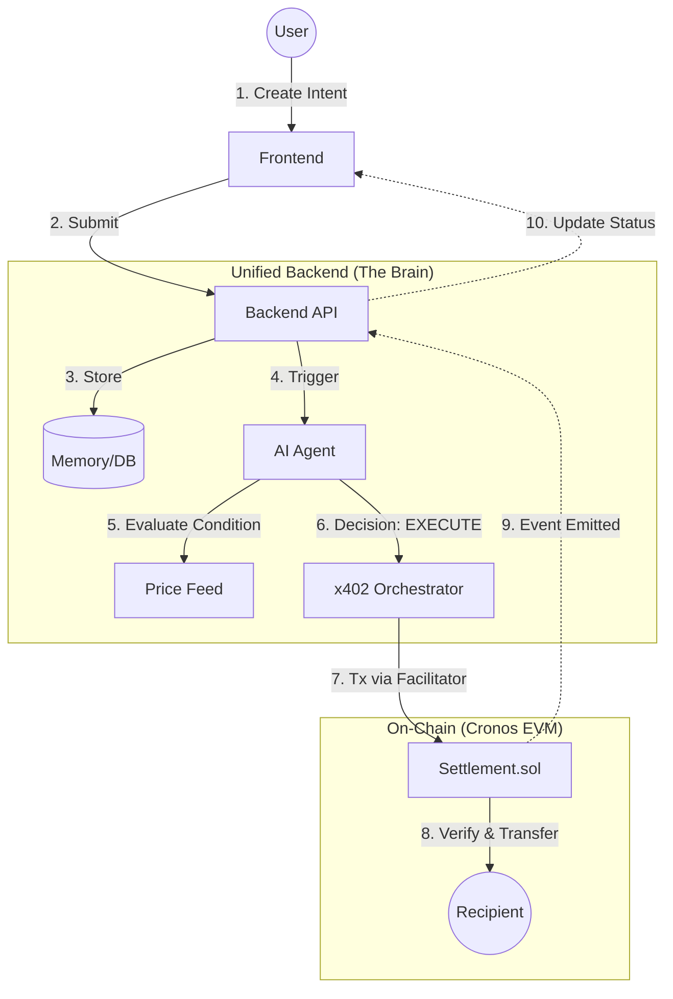

# System Architecture

## Overview
**Cronos x402 Agentic Treasury** is a hybrid system where an off-chain AI Agent controls on-chain programmatic settlements via the x402 protocol on Cronos EVM.

## High-Level Flow

## Core Components

### 1. Payment Intent (The Truth)
The atomic unit of the system.
- **ID**: UUID
- **Condition**: Logic to evaluate (e.g., `ETH < 3000`)
- **Status**: `pending` -> `executed` | `failed`

### 2. AI Agent (The Decider)
- **Role**: Pure logic.
- **Input**: Payment Intent + External Data (Price, Time).
- **Output**: Boolean Decision (`EXECUTE` / `SKIP`).
- **Constraint**: NEVER signs transactions directly.

### 3. x402 Orchestrator (The Executor)
- **Role**: Execution mechanism.
- **Input**: Positive Agent Decision.
- **Action**: Signs & broadcasts transaction to `Settlement.sol`.

### 4. Settlement Contract (The Vault)
- **Network**: Cronos Testnet (EVM)
- **Role**: Holds funds & executes transfers.
- **Security**: Verifies `intentHash` before releasing funds.

