# Chat-Based Payment System Architecture

## Executive Summary

This document outlines the comprehensive architecture for a chat-based payment system that transforms Cronos Snow Rail into a powerful, conversational payment platform with real-time notifications, B2B bulk operations, and advanced features.

## System Overview


## Core Components

### 1. Chat Service Architecture

```mermaid
graph LR
    subgraph "Chat Interface"
        Input[Message Input]
        Parser[Command Parser]
        Validator[Input Validator]
    end

    subgraph "Command Handlers"
        PayCmd[/pay command]
        DepCmd[/deposit command]
        WithCmd[/withdraw command]
        MixCmd[/mix command]
        BulkCmd[/bulk command]
        StatusCmd[/status command]
        HelpCmd[/help command]
    end

    subgraph "Response Generator"
        Template[Template Engine]
        Formatter[Rich Formatter]
        Preview[Transaction Preview]
    end

    Input --> Parser
    Parser --> Validator
    Validator --> PayCmd
    Validator --> DepCmd
    Validator --> WithCmd
    Validator --> MixCmd
    Validator --> BulkCmd
    Validator --> StatusCmd
    Validator --> HelpCmd

    PayCmd --> Template
    DepCmd --> Template
    WithCmd --> Template
    MixCmd --> Template
    BulkCmd --> Template

    Template --> Formatter
    Formatter --> Preview
```

### 2. WebSocket Real-time Architecture

```mermaid
sequenceDiagram
    participant User
    participant WSClient
    participant WSServer
    participant Redis
    participant Service
    participant Blockchain

    User->>WSClient: Connect
    WSClient->>WSServer: WebSocket Handshake
    WSServer->>WSClient: Connection Established

    User->>WSClient: /pay @alice 100 CRO
    WSClient->>WSServer: Chat Message
    WSServer->>Service: Parse & Execute
    Service->>Service: Create Intent
    Service->>Redis: Publish Event
    Redis->>WSServer: Event Received
    WSServer->>WSClient: ✓ Intent Created

    Service->>Blockchain: Submit Transaction
    Blockchain-->>Service: TX Pending
    Service->>Redis: Publish Status
    Redis->>WSServer: Status Update
    WSServer->>WSClient: ⏳ Transaction Pending

    Blockchain-->>Service: TX Confirmed
    Service->>Redis: Publish Success
    Redis->>WSServer: Success Event
    WSServer->>WSClient: ✅ Payment Complete
```



### 3. B2B Bulk Payment Flow


## Chat Command Specification

### Payment Commands

#### `/pay <recipient> <amount> [currency]`
**Purpose:** Send immediate payment
**Example:** `/pay 0x742d35...3dF4 100 CRO`
**Response:**
```
💰 Payment Intent Created
━━━━━━━━━━━━━━━━━━━━━━━
To: 0x742d...3dF4
Amount: 100 CRO ($45.23)
Status: ⏳ Pending deposit

[Deposit Now] [Cancel]
```

#### `/deposit <intentId> <amount>`
**Purpose:** Fund an existing intent
**Example:** `/deposit intent-123 100`
**Response:**
```
📥 Deposit Transaction Ready
━━━━━━━━━━━━━━━━━━━━━━━
Intent: #intent-123
Amount: 100 CRO
Contract: 0xae6E...4382

[Sign Transaction]
```

#### `/withdraw <intentId>`
**Purpose:** Withdraw from mixer or cancel intent
**Example:** `/withdraw mixer-note-abc123`
**Response:**
```
📤 Withdrawal Prepared
━━━━━━━━━━━━━━━━━━━━━━━
Amount: 0.1 CRO
To: 0x742d...3dF4
Privacy: ✓ Anonymized

[Confirm Withdrawal]
```

#### `/mix <amount>`
**Purpose:** Deposit to privacy mixer
**Example:** `/mix 0.1`
**Response:**
```
🎭 Privacy Mixer
━━━━━━━━━━━━━━━━━━━━━━━
Deposit: 0.1 CRO
Anonymity Set: 1,247 deposits

⚠️ SAVE YOUR NOTE SECURELY:
━━━━━━━━━━━━━━━━━━━━━━━
Note: mixer_cronos_0x7f3d...a9c2
Nullifier: 0x8e4f...b1d3
Secret: 0x9a2c...e8f6

[Copy Note] [Continue]

⚠️ If you lose this note, funds cannot be recovered!
```

### B2B Commands

#### `/bulk upload`
**Purpose:** Upload CSV/JSON for bulk payments
**Example:** `/bulk upload`
**Response:**
```
📊 Bulk Payment Upload
━━━━━━━━━━━━━━━━━━━━━━━
Drag & drop CSV or JSON file
Or paste data directly

Format:
recipient,amount,currency
0x742d...3dF4,100,CRO
0x8a3e...9f2b,50,USDC
```

#### `/bulk preview <batchId>`
**Purpose:** Preview bulk payment batch
**Example:** `/bulk preview batch-456`
**Response:**
```
📋 Batch Preview: #batch-456
━━━━━━━━━━━━━━━━━━━━━━━
Recipients: 250
Total Amount: 12,500 CRO ($5,643.75)
Estimated Gas: 0.125 CRO ($0.056)
Processing Time: ~5 minutes

Recipients:
✓ 0x742d...3dF4 → 100 CRO
✓ 0x8a3e...9f2b → 50 CRO
... (248 more)

[Execute Batch] [Edit] [Cancel]
```

#### `/bulk status <batchId>`
**Purpose:** Check bulk payment status
**Example:** `/bulk status batch-456`
**Response:**
```
⏳ Batch Status: #batch-456
━━━━━━━━━━━━━━━━━━━━━━━
Progress: ████████░░ 80% (200/250)

✅ Completed: 200
⏳ Processing: 25
⏸️ Queued: 25
❌ Failed: 0

Latest:
✓ 0x9f3a...2e1d → 75 CRO [TX: 0x4a2b...]
✓ 0x1c5e...8f9a → 120 CRO [TX: 0x7e9c...]

[View Details] [Download Report]
```

### Status & Info Commands

#### `/status [intentId]`
**Purpose:** Check payment or wallet status
**Example:** `/status intent-123`
**Response:**
```
📊 Intent Status: #intent-123
━━━━━━━━━━━━━━━━━━━━━━━
Status: ✅ Executed
Recipient: 0x742d...3dF4
Amount: 100 CRO
Created: 2026-01-18 14:32:10
Executed: 2026-01-18 14:35:22
TX Hash: 0x8f9a...3e2d

[View on Explorer]
```

#### `/wallet`
**Purpose:** Show wallet balance and info
**Example:** `/wallet`
**Response:**
```
👛 Your Wallet
━━━━━━━━━━━━━━━━━━━━━━━
Address: 0x742d...3dF4

Balances:
💎 CRO: 1,250.45 ($564.32)
💵 USDC: 500.00 ($500.00)
💵 USDT: 250.00 ($250.00)

Recent Activity:
✓ Received 100 CRO [3m ago]
✓ Sent 50 USDC [1h ago]

[Deposit] [Send]
```

#### `/history [limit]`
**Purpose:** Show transaction history
**Example:** `/history 10`

#### `/help [command]`
**Purpose:** Show help for commands
**Example:** `/help pay`

## Notification System

### Notification Types

```typescript
enum NotificationType {
  PAYMENT_RECEIVED = 'payment_received',
  PAYMENT_SENT = 'payment_sent',
  DEPOSIT_CONFIRMED = 'deposit_confirmed',
  WITHDRAWAL_READY = 'withdrawal_ready',
  INTENT_FUNDED = 'intent_funded',
  INTENT_EXECUTED = 'intent_executed',
  BATCH_PROGRESS = 'batch_progress',
  BATCH_COMPLETE = 'batch_complete',
  TRANSACTION_PENDING = 'transaction_pending',
  TRANSACTION_CONFIRMED = 'transaction_confirmed',
  TRANSACTION_FAILED = 'transaction_failed',
  PRICE_ALERT = 'price_alert',
  SECURITY_ALERT = 'security_alert',
}

interface Notification {
  id: string;
  type: NotificationType;
  title: string;
  message: string;
  icon: string; // emoji or icon name
  priority: 'low' | 'medium' | 'high' | 'critical';
  timestamp: string;
  data: Record<string, any>;
  actions?: NotificationAction[];
  read: boolean;
  dismissible: boolean;
}

interface NotificationAction {
  label: string;
  command: string;
  style: 'primary' | 'secondary' | 'danger';
}
```

### Notification Examples

**Payment Received:**
```
🎉 Payment Received!
━━━━━━━━━━━━━━━━━━━━━━━
+100 CRO from 0x742d...3dF4
Value: $45.23
TX: 0x8f9a...3e2d

[View Details] [Send Thank You]
```

**Batch Progress:**
```
⏳ Bulk Payment Processing
━━━━━━━━━━━━━━━━━━━━━━━
Batch #batch-456
Progress: 75% (188/250)
ETA: 2 minutes

[View Status]
```

**Price Alert:**
```
📈 Price Alert Triggered!
━━━━━━━━━━━━━━━━━━━━━━━
CRO reached $0.45
Target: $0.50
Change: +12.5% (24h)

Intent #intent-789 ready to execute
[Execute Now] [Wait]
```

**Security Alert:**
```
🔐 Security Alert
━━━━━━━━━━━━━━━━━━━━━━━
New device login detected
Location: San Francisco, CA
Time: 2026-01-18 14:30:00

[Approve] [Deny] [Review]
```

### Real-time Notification Flow


## Technical Stack

### New Technologies to Add

| Component | Technology | Purpose |
|-----------|-----------|---------|
| **WebSocket Server** | Socket.io | Real-time bidirectional communication |
| **Message Queue** | Bull/BullMQ | Job queue for batch processing |
| **Cache/Pub-Sub** | Redis | Real-time event distribution |
| **Database** | PostgreSQL + Prisma | Persistent storage for chat, notifications |
| **File Upload** | Multer | CSV/JSON batch upload handling |
| **CSV Parser** | Papa Parse | Bulk payment file parsing |
| **Rich Text** | Slate.js or Lexical | Chat message formatting |
| **Animations** | Framer Motion | Smooth notification animations |

### Database Schema

```prisma
// prisma/schema.prisma

model User {
  id            String   @id @default(uuid())
  address       String   @unique
  username      String?
  avatar        String?
  createdAt     DateTime @default(now())
  updatedAt     DateTime @updatedAt

  chatMessages  ChatMessage[]
  notifications Notification[]
  bulkBatches   BulkBatch[]
}

model ChatMessage {
  id          String   @id @default(uuid())
  userId      String
  user        User     @relation(fields: [userId], references: [id])
  content     String
  command     String?
  metadata    Json?
  createdAt   DateTime @default(now())

  @@index([userId, createdAt])
}

model Notification {
  id          String   @id @default(uuid())
  userId      String
  user        User     @relation(fields: [userId], references: [id])
  type        String
  title       String
  message     String
  icon        String
  priority    String
  data        Json
  read        Boolean  @default(false)
  dismissible Boolean  @default(true)
  createdAt   DateTime @default(now())

  @@index([userId, read, createdAt])
}

model BulkBatch {
  id          String   @id @default(uuid())
  userId      String
  user        User     @relation(fields: [userId], references: [id])
  status      String   // pending, processing, completed, failed
  totalCount  Int
  processedCount Int   @default(0)
  failedCount Int      @default(0)
  totalAmount String
  currency    String
  transactions Json    // Array of transaction details
  createdAt   DateTime @default(now())
  completedAt DateTime?

  @@index([userId, status, createdAt])
}

model Intent {
  id          String   @id @default(uuid())
  userId      String
  amount      String
  currency    String
  recipient   String
  condition   Json?
  status      String
  txHash      String?
  deposit     Json?
  createdAt   DateTime @default(now())
  executedAt  DateTime?

  @@index([userId, status, createdAt])
}

model MixerDeposit {
  id          String   @id @default(uuid())
  userId      String
  commitment  String   @unique
  nullifierHash String @unique
  leafIndex   Int?
  amount      String
  txHash      String?
  withdrawn   Boolean  @default(false)
  createdAt   DateTime @default(now())
  withdrawnAt DateTime?

  @@index([userId, withdrawn])
}
```

## Implementation Plan

### Phase 1: Foundation (Week 1-2)

**Backend:**
1. Setup PostgreSQL + Prisma ORM
2. Implement WebSocket server with Socket.io
3. Setup Redis for pub/sub
4. Create ChatService with command parser
5. Create NotificationService
6. Migrate IntentService to use Prisma

**Frontend:**
1. Create ChatInterface component
2. Setup Socket.io client
3. Create NotificationCenter component
4. Create Toast notification system
5. Implement WebSocket reconnection logic

**Deliverable:** Basic chat interface with `/pay`, `/status`, `/help` commands

### Phase 2: Advanced Payments (Week 3-4)

**Backend:**
1. Implement `/deposit`, `/withdraw`, `/mix` commands
2. Integrate with existing MixerService
3. Create transaction preview generator
4. Implement real-time status updates
5. Add transaction confirmation tracking

**Frontend:**
1. Create TransactionPreview component
2. Add signature request dialogs
3. Implement real-time status indicators
4. Create MixerNote display component
5. Add clipboard copy functionality

**Deliverable:** Full payment operations through chat

### Phase 3: B2B Bulk Payments (Week 5-6)

**Backend:**
1. Setup Bull/BullMQ for job processing
2. Create BulkPaymentService
3. Implement CSV/JSON parser
4. Create batch validation logic
5. Implement queue workers for parallel processing
6. Add progress tracking and reporting

**Frontend:**
1. Create file upload component
2. Create batch preview interface
3. Add progress visualization
4. Create batch status dashboard
5. Add export/download reports

**Deliverable:** Bulk payment capability with 1000+ transactions

### Phase 4: Notifications & Polish (Week 7-8)

**Backend:**
1. Implement all notification types
2. Create notification priority system
3. Add notification preferences
4. Implement price alerts
5. Add security alerts

**Frontend:**
1. Create animated notification components
2. Add notification sound effects
3. Implement notification center with filters
4. Add notification preferences UI
5. Create beautiful animations with Framer Motion

**Deliverable:** Production-ready notification system

### Phase 5: Security & Optimization (Week 9-10)

**Backend:**
1. Implement rate limiting
2. Add command authorization
3. Implement audit logging
4. Add transaction signing validation
5. Performance optimization
6. Load testing

**Frontend:**
1. Add input sanitization
2. Implement error boundaries
3. Add loading states
4. Optimize WebSocket performance
5. Add offline support

**Deliverable:** Secure, optimized production system

## Security Considerations

### Authentication & Authorization

```typescript
// WebSocket Authentication
interface WSAuthMessage {
  type: 'auth';
  token: string; // JWT from wallet signature
  address: string;
}

// Command Authorization
interface CommandPermissions {
  '/pay': ['user', 'admin'];
  '/deposit': ['user', 'admin'];
  '/withdraw': ['user', 'admin'];
  '/mix': ['user', 'admin'];
  '/bulk': ['business', 'admin'];
  '/admin': ['admin'];
}
```

### Rate Limiting

```typescript
const rateLimits = {
  '/pay': { max: 10, window: '1m' },
  '/deposit': { max: 5, window: '1m' },
  '/withdraw': { max: 5, window: '1m' },
  '/bulk': { max: 2, window: '5m' },
  messages: { max: 50, window: '1m' },
};
```

### Input Validation

```typescript
// Command Input Schema
const payCommandSchema = z.object({
  recipient: z.string().regex(/^0x[a-fA-F0-9]{40}$/),
  amount: z.string().regex(/^\d+(\.\d+)?$/),
  currency: z.enum(['CRO', 'WCRO', 'USDC', 'USDT']),
});

// Bulk Upload Schema
const bulkUploadSchema = z.array(
  z.object({
    recipient: z.string().regex(/^0x[a-fA-F0-9]{40}$/),
    amount: z.string().regex(/^\d+(\.\d+)?$/),
    currency: z.enum(['CRO', 'WCRO', 'USDC', 'USDT']),
  })
).max(10000); // Limit to 10k transactions per batch
```

### Transaction Security

1. **Double-Spend Prevention**: Check for duplicate intents before creation
2. **Amount Validation**: Verify user has sufficient balance
3. **Recipient Verification**: Optional whitelist for B2B accounts
4. **Transaction Limits**: Daily/monthly transaction limits
5. **Audit Trail**: Log all commands and transactions

## Performance Optimization

### WebSocket Scaling

```typescript
// Use Redis adapter for multi-server WebSocket
const io = new Server(server, {
  adapter: createAdapter(pubClient, subClient),
  cors: {
    origin: process.env.CORS_ALLOWED_ORIGINS?.split(','),
    credentials: true,
  },
  transports: ['websocket', 'polling'],
  pingTimeout: 60000,
  pingInterval: 25000,
});
```

### Batch Processing Optimization

```typescript
// Process in parallel batches
const BATCH_SIZE = 50;
const CONCURRENT_BATCHES = 5;

async function processBulkPayment(batch: BulkBatch) {
  const transactions = batch.transactions;

  for (let i = 0; i < transactions.length; i += BATCH_SIZE) {
    const chunk = transactions.slice(i, i + BATCH_SIZE);

    // Process CONCURRENT_BATCHES chunks in parallel
    await Promise.all(
      chunk.map(tx => processTransaction(tx))
    );

    // Update progress
    await updateBatchProgress(batch.id, i + chunk.length);
  }
}
```

### Caching Strategy

```typescript
// Cache frequently accessed data
const cacheConfig = {
  userProfile: { ttl: 300 }, // 5 minutes
  intentStatus: { ttl: 10 }, // 10 seconds
  walletBalance: { ttl: 30 }, // 30 seconds
  priceData: { ttl: 60 }, // 1 minute
};
```

## Monitoring & Analytics

### Metrics to Track

1. **WebSocket Metrics:**
   - Active connections
   - Connection duration
   - Message throughput
   - Reconnection rate

2. **Chat Metrics:**
   - Commands per minute
   - Command success rate
   - Average response time
   - Error rate by command

3. **Payment Metrics:**
   - Payments per hour
   - Average payment size
   - Success rate
   - Failed transaction reasons

4. **Batch Metrics:**
   - Batches processed
   - Average batch size
   - Processing time
   - Success rate

5. **Notification Metrics:**
   - Notifications sent
   - Read rate
   - Action click-through rate
   - Notification delay

## Advanced Features

### AI-Powered Chat Assistant

```typescript
// Natural language processing for commands
User: "Send 100 CRO to Alice"
AI: "I'll help you send 100 CRO. What's Alice's address?"
User: "0x742d35Cc6634C0532925a3b844Bc9e7595f39dF4"
AI: "Got it! Creating payment intent for 100 CRO to 0x742d...3dF4"
    [Preview shown]
    "Confirm by typing /confirm or click the button"
```

### Smart Scheduling

```typescript
// Schedule future payments
User: "/pay 0x742d...3dF4 100 CRO at 2026-01-25 14:00"
System: "✓ Payment scheduled for Jan 25, 2026 at 2:00 PM"
```

### Recurring Payments

```typescript
// Setup recurring payments
User: "/recurring setup"
System: "Setting up recurring payment:"
        "Recipient: [address input]"
        "Amount: [amount input]"
        "Frequency: [daily/weekly/monthly]"
        "Start date: [date picker]"
```

### Payment Templates

```typescript
// Save payment templates
User: "/template save payroll"
System: "Template 'payroll' saved with 50 recipients"

User: "/template run payroll"
System: "Running payroll template (50 payments)"
```

### Multi-signature Support

```typescript
// Multi-sig payment requests
User: "/multisig create 3-of-5"
System: "Multi-sig wallet created"
        "Signers needed: 3"
        "Total signers: 5"
```

## UX Enhancements

### Command Auto-completion

```typescript
// As user types, show suggestions
User types: "/p"
Suggestions:
  /pay <recipient> <amount> [currency]
  /preview <intentId>

User types: "/pay 0x"
Suggestions:
  Recent recipients:
  • 0x742d...3dF4 (Alice)
  • 0x8a3e...9f2b (Bob)
  • 0x1c5e...8f9a (Carol)
```

### Transaction Preview

```typescript
// Rich preview before confirmation
┌─────────────────────────────────┐
│  💰 Payment Preview             │
├─────────────────────────────────┤
│  From:  0x9f3a...2e1d          │
│  To:    0x742d...3dF4          │
│  Amount: 100 CRO ($45.23)      │
│                                 │
│  Gas Fee: ~0.002 CRO ($0.001)  │
│  Total:   100.002 CRO          │
│                                 │
│  ⏱️ Estimated Time: ~3 seconds  │
│  🔐 Privacy: Standard           │
├─────────────────────────────────┤
│  [Confirm]  [Edit]  [Cancel]   │
└─────────────────────────────────┘
```

### Progress Indicators

```typescript
// Animated progress for transactions
⏳ Processing Payment...
━━━━━━━━━━━━━━━━━━━━━━━
▓▓▓▓▓▓▓▓▓▓░░░░░░░░░░ 50%

1. ✅ Intent created
2. ✅ Deposit confirmed
3. ⏳ Executing settlement...
4. ⏸️ Waiting for confirmation
```

### Emoji Status Indicators

```
✅ Completed
⏳ Processing
⏸️ Pending
❌ Failed
🎭 Mixed (private)
💎 High value
⚡ Fast track
🔒 Secured
🌟 Featured
```

## File Structure

```
cronos-snowrail/
├── apps/
│   ├── backend/
│   │   ├── src/
│   │   │   ├── api/
│   │   │   │   └── routes/
│   │   │   │       ├── chat.ts (NEW)
│   │   │   │       ├── websocket.ts (NEW)
│   │   │   │       ├── bulk.ts (NEW)
│   │   │   │       └── notifications.ts (NEW)
│   │   │   ├── services/
│   │   │   │   ├── chat-service.ts (NEW)
│   │   │   │   ├── command-parser.ts (NEW)
│   │   │   │   ├── notification-service.ts (NEW)
│   │   │   │   ├── bulk-payment-service.ts (NEW)
│   │   │   │   ├── websocket-service.ts (NEW)
│   │   │   │   └── intent-service.ts (MODIFY - add Prisma)
│   │   │   ├── workers/
│   │   │   │   └── bulk-processor.ts (NEW)
│   │   │   ├── utils/
│   │   │   │   ├── command-validator.ts (NEW)
│   │   │   │   └── response-formatter.ts (NEW)
│   │   │   └── types/
│   │   │       ├── chat.types.ts (NEW)
│   │   │       └── notification.types.ts (NEW)
│   │   └── prisma/
│   │       └── schema.prisma (NEW)
│   │
│   └── frontend/
│       ├── src/
│       │   ├── components/
│       │   │   ├── chat/
│       │   │   │   ├── chat-interface.tsx (NEW)
│       │   │   │   ├── message-list.tsx (NEW)
│       │   │   │   ├── message-input.tsx (NEW)
│       │   │   │   ├── command-suggestions.tsx (NEW)
│       │   │   │   └── transaction-preview.tsx (NEW)
│       │   │   ├── notifications/
│       │   │   │   ├── notification-center.tsx (NEW)
│       │   │   │   ├── notification-item.tsx (NEW)
│       │   │   │   ├── toast-notification.tsx (NEW)
│       │   │   │   └── notification-bell.tsx (NEW)
│       │   │   ├── bulk/
│       │   │   │   ├── bulk-upload.tsx (NEW)
│       │   │   │   ├── batch-preview.tsx (NEW)
│       │   │   │   ├── batch-progress.tsx (NEW)
│       │   │   │   └── batch-report.tsx (NEW)
│       │   │   └── wallet/
│       │   │       └── wallet-widget.tsx (NEW)
│       │   ├── hooks/
│       │   │   ├── use-websocket.ts (NEW)
│       │   │   ├── use-chat.ts (NEW)
│       │   │   ├── use-notifications.ts (NEW)
│       │   │   └── use-bulk-payment.ts (NEW)
│       │   ├── services/
│       │   │   ├── websocket-client.ts (NEW)
│       │   │   └── notification-client.ts (NEW)
│       │   └── utils/
│       │       ├── command-formatter.ts (NEW)
│       │       └── notification-formatter.ts (NEW)
│
├── packages/
│   └── shared-types/
│       └── src/
│           ├── chat.types.ts (NEW)
│           ├── notification.types.ts (NEW)
│           └── bulk.types.ts (NEW)
│
└── docs/
    ├── CHAT_PAYMENT_ARCHITECTURE.md (THIS FILE)
    ├── CHAT_COMMANDS.md (NEW)
    └── NOTIFICATION_GUIDE.md (NEW)
```

## Deployment Architecture


## Success Metrics

### User Engagement
- Daily active users (DAU)
- Average session duration
- Commands per user per day
- Chat message frequency

### Payment Metrics
- Total payment volume
- Average payment size
- Payment success rate
- Time to completion

### B2B Adoption
- Number of bulk batches
- Average batch size
- Total B2B volume
- Batch success rate

### Notification Performance
- Notification delivery time (< 100ms)
- Notification read rate (> 70%)
- Action completion rate (> 30%)

## Conclusion

This architecture transforms Cronos Snow Rail into a powerful, chat-first payment platform with:

✅ **Intuitive Chat Interface** - Natural conversation for payments
✅ **Real-time Updates** - WebSocket-powered instant notifications
✅ **B2B Capabilities** - Bulk payments for enterprise use
✅ **Advanced Features** - Templates, scheduling, multi-sig
✅ **Beautiful UX** - Animated notifications and rich previews
✅ **Secure & Scalable** - Production-ready security and performance
✅ **Extensible** - Built on existing services, easy to enhance

The system leverages existing IntentService, MixerService, and WalletService while adding a conversational layer that makes blockchain payments as easy as sending a text message.
